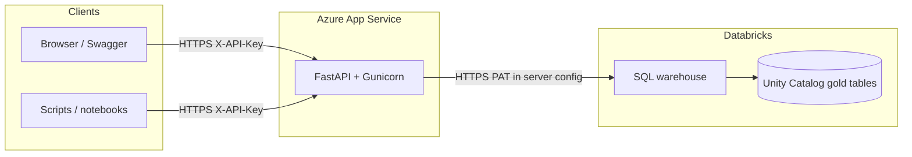
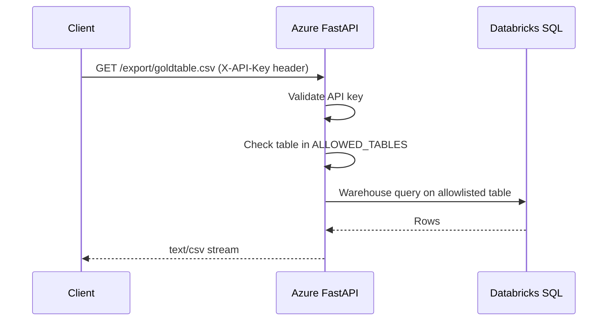
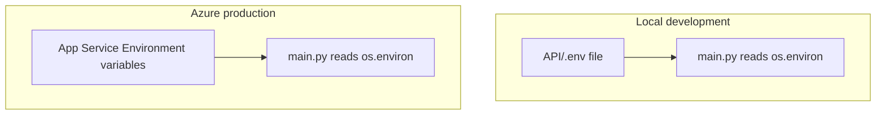
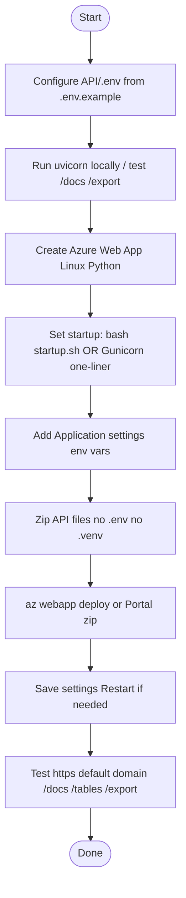

# GEMS Gold Export API

FastAPI service: clients send an **API key** in a header → the service returns **CSV** exports of **allowlisted** Unity Catalog **gold** tables by querying a **Databricks SQL warehouse** with a **personal access token (PAT)** stored on the server.

**Important:** The API loads **`API/.env`** only (same folder as `main.py`). A **repo-root** `.env` is for other project tools; this service does not read it.

---

## Table of contents

1. [What we built (high level)](#1-what-we-built-high-level)
2. [Architecture diagrams](#2-architecture-diagrams)
3. [End-to-end deployment workflow](#3-end-to-end-deployment-workflow)
4. [Prerequisites](#4-prerequisites)
5. [Phase A — Run and test locally](#5-phase-a--run-and-test-locally)
6. [Phase B — Azure App Service](#6-phase-b--azure-app-service)
7. [Phase C — Environment variables (production)](#7-phase-c--environment-variables-production)
8. [Phase D — Package and deploy code](#8-phase-d--package-and-deploy-code)
9. [Phase E — Verify and hand off](#9-phase-e--verify-and-hand-off)
10. [Day-2 operations](#10-day-2-operations)
11. [Troubleshooting](#11-troubleshooting)
12. [Security checklist](#12-security-checklist)
13. [PAT vs service principal](#13-pat-vs-service-principal)

---

## 1. What we built (high level)

| Piece | Role |
|--------|------|
| **This repo (`API/`)** | Python app: `main.py`, `requirements.txt`, optional `startup.sh`, `.deployment`. |
| **Local machine** | Edit secrets in `API/.env` (gitignored); run with `uvicorn` for development. |
| **Azure App Service (Linux, Python)** | Hosts the same app 24/7; secrets live in **Environment variables** (Application settings), **not** in the zip. |
| **Databricks** | SQL warehouse executes `SELECT * FROM catalog.schema.table` for allowlisted tables; PAT must have access. |

Users never receive the Databricks token. They only use **`X-API-Key`** over **HTTPS** and known URLs such as `/tables` and `/export/{table}.csv`.

---

## 2. Architecture diagrams

### 2.1 System context



### 2.2 Request flow (export CSV)



### 2.3 Configuration split (local vs Azure)



Variable names match in both places: `DATABRICKS_*`, `GEMS_*`, `ALLOWED_TABLES`, `GEMS_API_KEY`, etc.

---

## 3. End-to-end deployment workflow



**Where each step happens**

| Step | Where |
|------|--------|
| Copy `.env.example` → `.env`, edit secrets | **Cursor / local** — `API/` folder |
| Local run & Swagger tests | **Your PC** — `http://127.0.0.1:8000/docs` |
| Create Web App, pricing plan, region | **Azure Portal** (or CLI) |
| Startup command | **Portal** Configuration → General settings, or **`az webapp config set`** |
| `DATABRICKS_*`, `GEMS_*`, `ALLOWED_TABLES`, `GEMS_API_KEY` | **Azure Portal** → Web App → **Environment variables** → App settings |
| Build `gems-api.zip` | **PowerShell** from repo (see §8) |
| Upload / deploy zip | **Azure CLI** `az webapp deploy` or Portal **Deployment Center** |
| Confirm hostname | **Azure Portal** → Web App → **Overview** → **Default domain** (often `https://<name>-<suffix>.eastus-01.azurewebsites.net`) |

There is **no automatic sync** from GitHub to Azure Application settings unless you add CI/CD (e.g. GitHub Actions + `az webapp config appsettings set`). For this project, **production config is edited in Azure**; keep **`.env.example`** updated in git as **documentation only** (no real secrets).

---

## 4. Prerequisites

- **Databricks:** PAT (Settings → Developer → Access tokens) and a **SQL warehouse** you may use (**SQL → SQL Warehouses → Connection details**: host + HTTP path).
- **Unity Catalog:** the PAT’s user (or service principal, if you switch later) needs **`SELECT`** on the gold tables you will list in `ALLOWED_TABLES`.
- **Azure:** subscription and rights to create an **App Service** (Web App), Linux, Python 3.11+ (3.12 is fine).
- **Optional:** [Azure CLI](https://learn.microsoft.com/cli/azure/install-azure-cli) on your PC for zip deploy and `az webapp` commands (use the correct subscription: `az account set`).

---

## 5. Phase A — Run and test locally

```powershell
cd API
copy .env.example .env
```

Edit **`API/.env`** with real values. **Never commit `.env`.** Do not put secrets in `.env.example`.

| Variable | Purpose |
|----------|---------|
| `DATABRICKS_HOST` | e.g. `adb-123.4.azuredatabricks.net` (no `https://`) |
| `DATABRICKS_HTTP_PATH` | e.g. `/sql/1.0/warehouses/...` |
| `DATABRICKS_TOKEN` | PAT |
| `GEMS_CATALOG` / `GEMS_SCHEMA` | Unity Catalog location of gold tables |
| `ALLOWED_TABLES` | Comma-separated **table names only** (e.g. `goldanimalcharacteristics,goldbodyweight`) |
| `GEMS_API_KEY` | Long random string; clients send it as **`X-API-Key`** |
| `MAX_EXPORT_ROWS` | Optional cap (default `100000` in code if unset) |

Run:

```powershell
python -m venv .venv
.venv\Scripts\activate
pip install -r requirements.txt
uvicorn main:app --reload --host 127.0.0.1 --port 8000
```

Smoke tests:

| URL / action | Expected |
|--------------|----------|
| `http://127.0.0.1:8000/docs` | Swagger UI |
| `GET /health` | `status` ok/degraded + `allowed_table_count` |
| `GET /tables` with header `X-API-Key: <GEMS_API_KEY>` | JSON list of allowed tables |
| `GET /export/<table>.csv` with same header | CSV download |

---

## 6. Phase B — Azure App Service

1. **Azure Portal** → **Create a resource** → **Web App**.
2. **Publish:** Code. **Runtime stack:** Python **3.11** or **3.12**. **OS:** **Linux**.
3. Choose **region** and **App Service plan** (e.g. **Basic B1** or higher if you need **Always On**).
4. After create: note **Resource group** and **Web App name** for CLI commands.

### Startup command

The app must listen on **`0.0.0.0`** (and use **`PORT`** if your platform sets it — this repo’s `startup.sh` defaults to `8000`).

**Option A — `startup.sh` (in zip)**

Portal: **Configuration** → **General settings** → **Startup Command:**

```bash
bash startup.sh
```

**Option B — Gunicorn one-liner (avoids bash/CRLF issues)**

```bash
gunicorn main:app --workers 2 --worker-class uvicorn.workers.UvicornWorker --bind 0.0.0.0:8000
```

If the portal does not show Startup Command, use Azure CLI (replace names):

```bash
az webapp config set --resource-group YOUR_RG --name YOUR_APP --startup-file "gunicorn main:app --workers 2 --worker-class uvicorn.workers.UvicornWorker --bind 0.0.0.0:8000"
az webapp restart --resource-group YOUR_RG --name YOUR_APP
```

Enable **Always On** under **Configuration → General settings** if your plan supports it.

---

## 7. Phase C — Environment variables (production)

**Azure Portal** → your Web App → **Settings** → **Environment variables** → **App settings** → **+ Add** for each row (same names as `.env`).

| Name | Notes |
|------|--------|
| `DATABRICKS_HOST` | No `https://` |
| `DATABRICKS_HTTP_PATH` | Full path from warehouse connection details |
| `DATABRICKS_TOKEN` | PAT |
| `GEMS_CATALOG` / `GEMS_SCHEMA` | If omitted, defaults in code apply |
| `ALLOWED_TABLES` | Comma-separated table names |
| `GEMS_API_KEY` | Shared secret for `X-API-Key` |
| `MAX_EXPORT_ROWS` | Optional |

**Deployment slot setting:** leave **unchecked** unless you use staging slots and need different values per slot.

Click **Save** (app restarts). **Do not** put these values in git or in the deployment zip.

---

## 8. Phase D — Package and deploy code

Deploy so that **`main.py` is at the root of the site** (not inside a nested `API/API` folder). Include `requirements.txt`, `startup.sh` (if used), `.deployment`, and optionally `.env.example`, `.gitattributes`, `DEPLOY_AZURE.md`, `README.md`. **Exclude** `.venv`, `__pycache__`, and **`.env`**.

**Example (PowerShell)** — from the **`API`** directory:

```powershell
cd "...\data-entry-template\API"
$files = @('main.py','requirements.txt','startup.sh','.deployment','.env.example')
if (Test-Path '.gitattributes') { $files += '.gitattributes' }
if (Test-Path 'DEPLOY_AZURE.md') { $files += 'DEPLOY_AZURE.md' }
if (Test-Path 'README.md') { $files += 'README.md' }
Compress-Archive -Force -Path $files -DestinationPath ..\gems-api.zip
```

**On Windows, if you use `startup.sh`:** keep **LF** line endings (this repo includes **`.gitattributes`** for `startup.sh`). CRLF can cause `bash` errors on Azure Linux.

Deploy from the folder that contains **`gems-api.zip`**:

```powershell
cd "...\data-entry-template"
az webapp deploy --resource-group YOUR_RG --name YOUR_APP --src-path .\gems-api.zip --type zip
```

The **`.deployment`** file enables **`pip install -r requirements.txt`** during deployment on App Service.

---

## 9. Phase E — Verify and hand off

1. In **Overview**, copy the **Default domain** (e.g. `https://your-app-xxxx.eastus-01.azurewebsites.net`). Use this exact host — a different short name like `something.azurewebsites.net` may be a **different** application entirely.
2. Open **`https://<default-domain>/docs`**.
3. Click **Authorize**, enter **`GEMS_API_KEY`** as the **`X-API-Key`** value (not your Microsoft password).
4. Run **`GET /tables`** to list allowlisted names.
5. Run **`GET /export/{table}.csv`**: set path parameter **`table`** to e.g. `goldanimalcharacteristics` (no `.csv` in the parameter box).

**Collaborators** need: base URL, **`GEMS_API_KEY`**, and optionally **`GET /tables`** to discover names. Example PowerShell:

```powershell
$base = "https://YOUR-DEFAULT-DOMAIN"
$key  = "SHARED_GEMS_API_KEY"
Invoke-RestMethod -Uri "$base/tables" -Headers @{ "X-API-Key" = $key }
Invoke-WebRequest -Uri "$base/export/goldanimalcharacteristics.csv" -Headers @{ "X-API-Key" = $key } -OutFile "goldanimalcharacteristics.csv"
```

---

## 10. Day-2 operations

| Task | Where |
|------|--------|
| Add/remove **allowlisted tables** | Azure **Environment variables** → edit **`ALLOWED_TABLES`** → Save. No redeploy. |
| Rotate **`GEMS_API_KEY`** | Same; update Swagger **Authorize** and all scripts. |
| Change **Databricks PAT** | Edit **`DATABRICKS_TOKEN`** in Azure. |
| **Code** changes | Rebuild zip, **`az webapp deploy`** again. |
| Document table list for git (no secrets) | Edit **`API/.env.example`** in Cursor and commit. |

---

## 11. Troubleshooting

| Symptom | Likely cause | What to do |
|---------|----------------|------------|
| **`startup.sh: set: -: invalid option`** or bash parse errors | **`startup.sh` saved with CRLF** | Use LF endings, or switch startup to the **Gunicorn one-liner** (§6). |
| **`401` on `/tables` or `/export`** | Wrong or missing **`X-API-Key`** | Must match **`GEMS_API_KEY`** in Azure (or local `.env`). |
| **`403` Table not allowed** | Table not in **`ALLOWED_TABLES`** | Add name in Azure App settings (comma-separated). |
| **`502` Databricks query failed** | Token, warehouse path, firewall, or UC grants | Check **Log stream**; verify PAT and SQL warehouse; Databricks IP allow lists / Private Link. |
| Wrong UI: **Microsoft login**, “Gotham”, **Gems** sidebar | You opened a **different URL** / different Web App | Use **Default domain** from **your** GEMS-API **Overview**. This CSV API uses **API key**, not Entra login in the browser (except whatever the portal itself uses). |
| Swagger: “**Required field** `table`” on export | Empty **`table`** parameter | Type the table name only, e.g. `goldanimalcharacteristics`. |
| Empty **App settings** in Portal after thinking you saved | Changes not saved | **Save** on the Environment variables blade; restart if needed. |

**Diagnostics:** **Portal → Web App → Log stream** (and **Diagnose and solve problems**).

---

## 12. Security checklist

- Keep **`DATABRICKS_TOKEN`**, **`GEMS_API_KEY`**, and **`API/.env`** out of git and out of zip artifacts.
- Use **HTTPS** only for real use; **`HTTPS only`** on the Web App is recommended.
- **`ALLOWED_TABLES`** is the only table names the code uses for user-driven exports — clients cannot pass arbitrary SQL.
- Rotate PAT and API key if exposed (e.g. screenshots with **curl** showing the key).

---

## 13. PAT vs service principal

- **PAT (typical for internal / MVP):** tied to a user; easiest if you can create tokens and have UC **SELECT**. Rotate on leak.
- **Service principal (long-term production):** requires admin setup and UC grants; decouples the API from one person’s account.

---

## Extra: Azure CLI quick reference

Copy-paste snippets and alternative zip paths also live in **`DEPLOY_AZURE.md`** in this folder.
