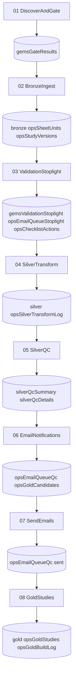

# GEMS Data Pipeline Flow (01–08)

## Summary

| Step | Notebook | Purpose | Key Outputs |
|------|----------|---------|-------------|
| **01** | DiscoverAndGate | Gate workbooks by DUA + Checklist + hash | `gemsGateResults` |
| **02** | BronzeIngest | Ingest to raw Bronze tables | `bronze*`, `opsSheetUnits`, `opsStudyVersions` |
| **03** | ValidationStoplight | Validate core + promised data | `gemsValidationStoplight`, `opsEmailQueueStoplight`, `opsChecklistActions` |
| **04** | SilverTransform | Clean Bronze → Silver | `silver*`, `opsSilverTransformLog` |
| **05** | SilverQC | Rulebook validation | `silverQcSummary`, `silverQcDetails` |
| **06** | EmailNotifications | Build emails, identify Gold candidates | `opsEmailQueueQc`, `opsGoldCandidates` |
| **07** | SendEmails | Send via Gmail SMTP | Updates `opsEmailQueueQc` |
| **08** | GoldStudies | Promote to Gold | `gold*`, `opsGoldStudies`, `opsGoldBuildLog` |
