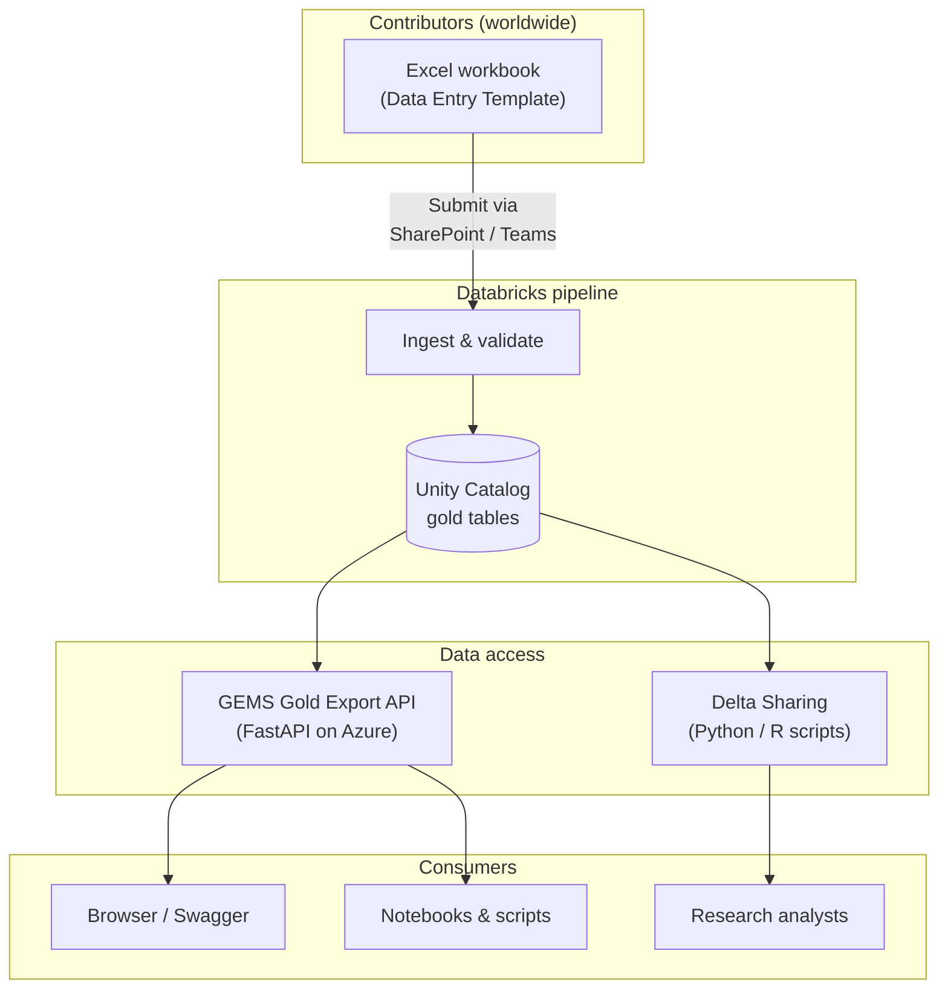

# GEMS Data Entry Template

Standardized data collection framework for the **GEMS** (Global Enteric Methane Study) project — an international livestock methane-emissions research initiative coordinated by Cornell University.

This repository contains:

- **Data Entry Template documentation** — describes the standardized Excel workbook (distributed to contributors via SharePoint / Teams) with structured sheets for animal, feed, production, and emissions data.
- **Reference data** — Breed lists, NDF/ADF fraction definitions, and other lookup material.

**API and Delta Sharing code** (FastAPI gold-table export, Python/R Delta Sharing clients) live in the companion repository **[gems-api](https://github.com/gems-project/gems-api)**. Use that repo for deployment, scripts, and technical READMEs. This repo may still include **`gems-api.zip`** as a pre-built API deployment archive when provided.

---

## Repository structure

```
data-entry-template/
├── GEMS-roll-out-memo.md      # Contributor onboarding instructions
├── reference/                 # Supporting lookup data
│   ├── breeds_updated.csv
│   ├── ADF_fractions.md
│   └── NDF_fractions.md
├── gems-api.zip               # Optional pre-built API archive (when present)
├── LICENSE
└── README.md
```

---

## How it all fits together



Implementation of the **API** and **Delta Sharing** clients is maintained in **[gems-api](https://github.com/gems-project/gems-api)**, not in this repository.

---

## Data Entry Template

The **Data Entry Template** workbook standardizes data collection across livestock experiments focused on methane emissions and related traits. Each workbook corresponds to **one study**. The workbook is distributed to contributors as a shared online copy via Microsoft Teams / SharePoint (not stored in this repository). See [`GEMS-roll-out-memo.md`](GEMS-roll-out-memo.md) for onboarding details.

### Workbook sheets

```mermaid
flowchart LR
    subgraph meta ["Animal & Experiment Metadata"]
        AC["AnimalCharacteristics"]
        ED["ExperimentalDesign"]
    end

    subgraph feed ["Feed & Intake"]
        FC["FeedComponents"]
        GP["GreenFeedPelletComponents"]
        IPD["IntakePerDay"]
        IID["IntakeIntraday"]
    end

    subgraph diet ["Diet & Digestibility"]
        DNC["DietNutrientComposition"]
        DIG["Digestibility"]
    end

    subgraph prod ["Production"]
        MK["Milk"]
        BW["BodyWeight"]
    end

    subgraph gf ["GreenFeed Emissions"]
        GFS["GreenFeedSettings"]
        GFD["GreenFeedDataFileReference"]
        GFG["GreenFeedGasMeasurement"]
    end

    subgraph rc ["Respiration Chamber"]
        RCS["RespirationChamberSettings"]
        RCM["RespirationChamberMeasurement"]
    end

    meta ~~~ feed ~~~ diet ~~~ prod ~~~ gf ~~~ rc
```



| Section | Sheets | Description |
|---------|--------|-------------|
| **Animal & Experiment** | `AnimalCharacteristics`, `ExperimentalDesign` | Animal identifiers, sex, breed, birthdate; study-level metadata (trial period, treatment groups, diet codes, housing, intake methods). |
| **Feed & Intake** | `FeedComponents`, `GreenFeedPelletComponents`, `IntakePerDay`, `IntakeIntraday` | Feed ingredients and proportions, GreenFeed pellet composition, daily and intraday feed consumption records. |
| **Diet & Digestibility** | `DietNutrientComposition`, `Digestibility` | Calculated nutritional content per diet (lab analysis or feed library values); fecal-collection or marker-based digestibility results. |
| **Production** | `Milk`, `BodyWeight` | Milk yield and composition (fat, protein, lactose); body weight measurements over time. |
| **GreenFeed** | `GreenFeedSettings`, `GreenFeedDataFileReference`, `GreenFeedGasMeasurement` | Device configuration, calibration parameters; C-Lock source file references; CH₄ and CO₂ emission measurements. |
| **Respiration Chamber** | `RespirationChamberSettings`, `RespirationChamberMeasurement` | Chamber equipment and setup; emission data per animal and timepoint. |

---

## GEMS Gold Export API and Delta Sharing

The **GEMS Gold Export API** (FastAPI CSV export from Unity Catalog) and **Delta Sharing** scripts (Python and R) are developed and documented in **[gems-api](https://github.com/gems-project/gems-api)**.

Clone that repository for local setup, Azure deployment steps, environment variables, and `config.share` usage. Do not expect `API/` or `Delta sharing/` directories in this **data-entry-template** repo.

---

## Reference data

The `reference/` folder contains supporting lookup material used during data entry and validation:

| File | Content |
|------|---------|
| `breeds_updated.csv` | Standardized breed names and codes. |
| `ADF_fractions.md` | Acid Detergent Fiber abbreviation definitions (ADF, aADF, ADFom, aADFom). |
| `NDF_fractions.md` | Neutral Detergent Fiber abbreviation definitions (NDF, aNDF, NDFom, aNDFom). |

---

## Contributor onboarding

New contributors should read [`GEMS-roll-out-memo.md`](GEMS-roll-out-memo.md) for:

- Study assignment and file-naming conventions (e.g. `001_LabName_1`).
- Instructions for working in the shared online workbook via SharePoint / Teams.
- Checklist and completion-tracking requirements (every sheet must be marked `Completed` or `Not relevant`).
- 30-day completion timeline and data-quality review process.

For questions, contact the **GEMS Coordination Team** at `gems@cornell.edu`.

---

## License

This project is licensed under the [MIT License](LICENSE).

Copyright (c) 2025 gems-project
