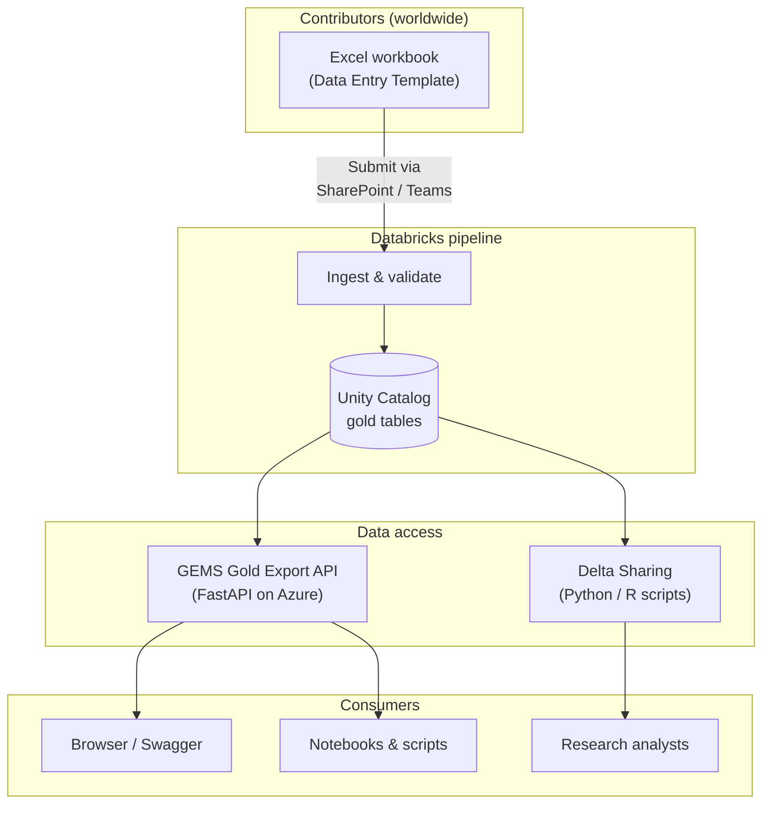
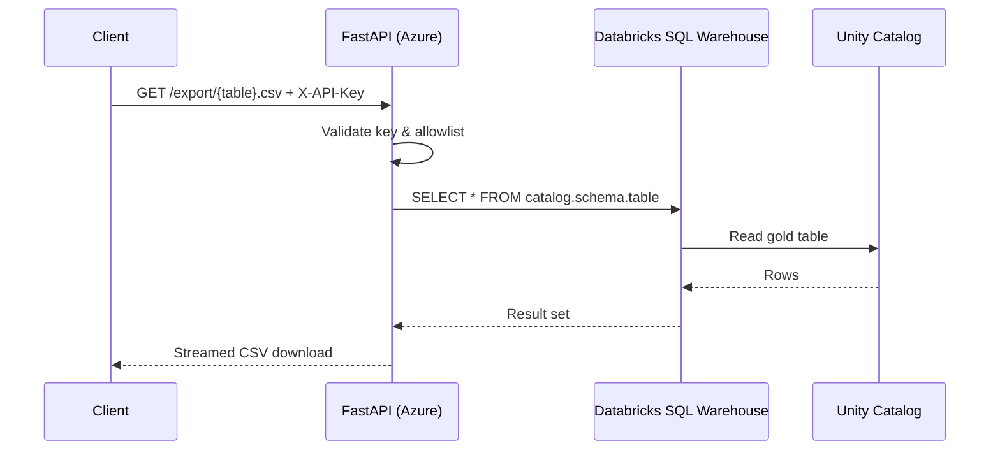
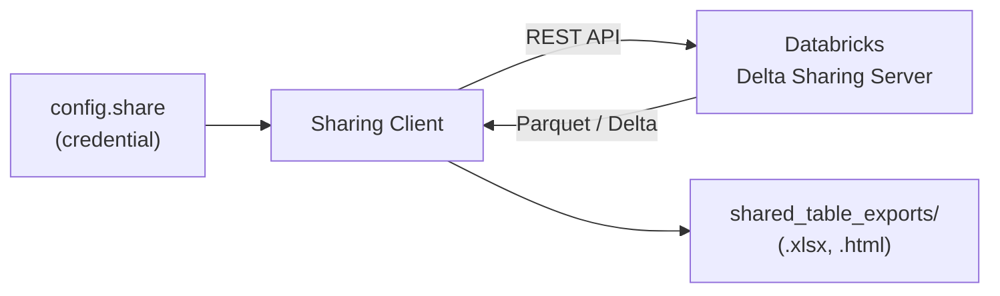

# GEMS Data Entry Template

Standardized data collection framework for the **GEMS** (Global Enteric Methane Study) project — an international livestock methane-emissions research initiative coordinated by Cornell University.

This repository contains:

- **Data Entry Template** — Excel workbook with structured sheets for animal, feed, production, and emissions data.
- **GEMS Gold Export API** — FastAPI service that exposes curated Databricks Unity Catalog tables as CSV downloads.
- **Delta Sharing scripts** — Python and R clients for downloading shared tables using a credential file.
- **Reference data** — Breed lists, NDF/ADF fraction definitions, and other lookup material.

---

## Repository structure

```
data-entry-template/
├── Data Entry Template.xlsx   # Main data-entry workbook
├── GEMS-roll-out-memo.md      # Contributor onboarding instructions
├── API/                       # GEMS Gold Export API (FastAPI)
│   ├── main.py
│   ├── requirements.txt
│   ├── .env.example
│   ├── startup.sh
│   ├── .deployment
│   ├── README.md              # Full API & Azure deployment guide
│   └── DEPLOY_AZURE.md        # Azure CLI quick reference
├── Delta sharing/             # Scripts to download shared tables
│   ├── load_shared_table.py
│   ├── load_shared_table.R
│   └── README.md
├── reference/                 # Supporting lookup data
│   ├── breeds_updated.csv
│   ├── ADF_fractions.md
│   └── NDF_fractions.md
├── gems-api.zip               # Pre-built API deployment archive
└── data-entry-template.Rproj  # RStudio project file
```

---

## How it all fits together



---

## Data Entry Template

The **`Data Entry Template.xlsx`** workbook standardizes data collection across livestock experiments focused on methane emissions and related traits. Each workbook corresponds to **one study**. Contributors work in a shared online copy via Microsoft Teams / SharePoint (see [`GEMS-roll-out-memo.md`](GEMS-roll-out-memo.md) for onboarding details).

### Workbook sheets

```mermaid
flowchart LR
    subgraph meta ["Animal & Experiment Metadata"]
        AC["AnimalCharacteristics"]
        ED["ExperimentalDesign"]
    end

    subgraph feed ["Feed & Intake"]
        FC["FeedComponents"]
        GP["GreenFeedPelletComponents"]
        IPD["IntakePerDay"]
        IID["IntakeIntraday"]
    end

    subgraph diet ["Diet & Digestibility"]
        DNC["DietNutrientComposition"]
        DIG["Digestibility"]
    end

    subgraph prod ["Production"]
        MK["Milk"]
        BW["BodyWeight"]
    end

    subgraph gf ["GreenFeed Emissions"]
        GFS["GreenFeedSettings"]
        GFD["GreenFeedDataFileReference"]
        GFG["GreenFeedGasMeasurement"]
    end

    subgraph rc ["Respiration Chamber"]
        RCS["RespirationChamberSettings"]
        RCM["RespirationChamberMeasurement"]
    end

    meta ~~~ feed ~~~ diet ~~~ prod ~~~ gf ~~~ rc
```



| Section | Sheets | Description |
|---------|--------|-------------|
| **Animal & Experiment** | `AnimalCharacteristics`, `ExperimentalDesign` | Animal identifiers, sex, breed, birthdate; study-level metadata (trial period, treatment groups, diet codes, housing, intake methods). |
| **Feed & Intake** | `FeedComponents`, `GreenFeedPelletComponents`, `IntakePerDay`, `IntakeIntraday` | Feed ingredients and proportions, GreenFeed pellet composition, daily and intraday feed consumption records. |
| **Diet & Digestibility** | `DietNutrientComposition`, `Digestibility` | Calculated nutritional content per diet (lab analysis or feed library values); fecal-collection or marker-based digestibility results. |
| **Production** | `Milk`, `BodyWeight` | Milk yield and composition (fat, protein, lactose); body weight measurements over time. |
| **GreenFeed** | `GreenFeedSettings`, `GreenFeedDataFileReference`, `GreenFeedGasMeasurement` | Device configuration, calibration parameters; C-Lock source file references; CH₄ and CO₂ emission measurements. |
| **Respiration Chamber** | `RespirationChamberSettings`, `RespirationChamberMeasurement` | Chamber equipment and setup; emission data per animal and timepoint. |

---

## GEMS Gold Export API

A read-only **FastAPI** service that lets authorized clients download curated **gold** tables from Databricks Unity Catalog as CSV files. Clients authenticate with a shared `X-API-Key` header; the server connects to a Databricks SQL warehouse using a PAT stored in environment variables.



### Endpoints

| Method | Path | Auth | Description |
|--------|------|------|-------------|
| `GET` | `/health` | None | Returns `ok` / `degraded` and `allowed_table_count`. |
| `GET` | `/tables` | `X-API-Key` | Lists allowlisted table names. |
| `GET` | `/export/{table}.csv` | `X-API-Key` | Downloads the table as a CSV file (streamed). |

### Quick start (local)

```powershell
cd API
copy .env.example .env        # fill in real values
python -m venv .venv
.venv\Scripts\activate
pip install -r requirements.txt
uvicorn main:app --reload --host 127.0.0.1 --port 8000
```

Then open `http://127.0.0.1:8000/docs` for the interactive Swagger UI.

### Azure deployment

The API is designed for **Azure App Service** (Linux, Python 3.11+). See [`API/README.md`](API/README.md) for the full deployment walkthrough and [`API/DEPLOY_AZURE.md`](API/DEPLOY_AZURE.md) for the CLI quick reference.

### Environment variables

| Variable | Purpose |
|----------|---------|
| `DATABRICKS_HOST` | Databricks workspace hostname (no `https://`). |
| `DATABRICKS_HTTP_PATH` | SQL warehouse HTTP path. |
| `DATABRICKS_TOKEN` | Databricks personal access token. |
| `GEMS_CATALOG` / `GEMS_SCHEMA` | Unity Catalog location of gold tables. |
| `ALLOWED_TABLES` | Comma-separated table names clients may export. |
| `GEMS_API_KEY` | Shared secret sent by clients as `X-API-Key`. |
| `MAX_EXPORT_ROWS` | Safety cap per export (default 100 000). |

---

## Delta Sharing

Python and R scripts that download shared tables using a **Databricks Delta Sharing** credential file (`config.share`). No browser login is required — the credential file contains a token, endpoint, and share reference.



| Script | Language | Outputs |
|--------|----------|---------|
| `load_shared_table.py` | Python | `.xlsx` and `.html` per table |
| `load_shared_table.R` | R | `.xlsx` per table (Parquet-backed shares only) |

### Usage

1. Place `config.share` (provided privately) next to the scripts.
2. Run one of:

```bash
python load_shared_table.py    # or python3
Rscript load_shared_table.R
```

3. Outputs appear under `shared_table_exports/`.

See [`Delta sharing/README.md`](Delta%20sharing/README.md) for detailed instructions, library usage examples, and troubleshooting.

---

## Reference data

The `reference/` folder contains supporting lookup material used during data entry and validation:

| File | Content |
|------|---------|
| `breeds_updated.csv` | Standardized breed names and codes. |
| `ADF_fractions.md` | Acid Detergent Fiber abbreviation definitions (ADF, aADF, ADFom, aADFom). |
| `NDF_fractions.md` | Neutral Detergent Fiber abbreviation definitions (NDF, aNDF, NDFom, aNDFom). |

---

## Contributor onboarding

New contributors should read [`GEMS-roll-out-memo.md`](GEMS-roll-out-memo.md) for:

- Study assignment and file-naming conventions (e.g. `001_LabName_1`).
- Instructions for working in the shared online workbook via SharePoint / Teams.
- Checklist and completion-tracking requirements (every sheet must be marked `Completed` or `Not relevant`).
- 30-day completion timeline and data-quality review process.

For questions, contact the **GEMS Coordination Team** at `gems@cornell.edu`.

---

## License

This project is licensed under the [MIT License](LICENSE).

Copyright (c) 2025 gems-project
